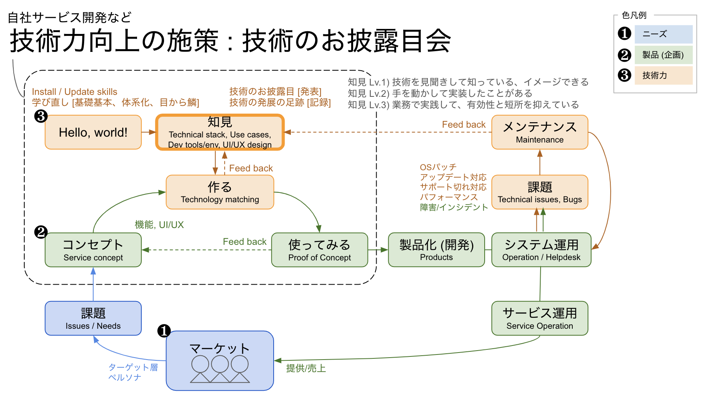

#技術のスキルと知見を向上するステートフロー図

##入り口

1. 市場のニーズ
2. コンセプト
3. エンジニアリング

##期待

- 自社プロダクトのエンジニア目線では、点線で囲んだ領域で、高速で試作 (Try & Error) して、うまくワークした機能を製品に取り込む流れが活発になると面白いことになりそうだと思う。テックブログも捗る。
- 新機能を受け入れる「製品化」側 (SRE) が拡張性の高い、且つ堅牢なアーキテクチャで待ち構えていてくれると心強い。インフラ的にも、ソフトウェア的にも。
